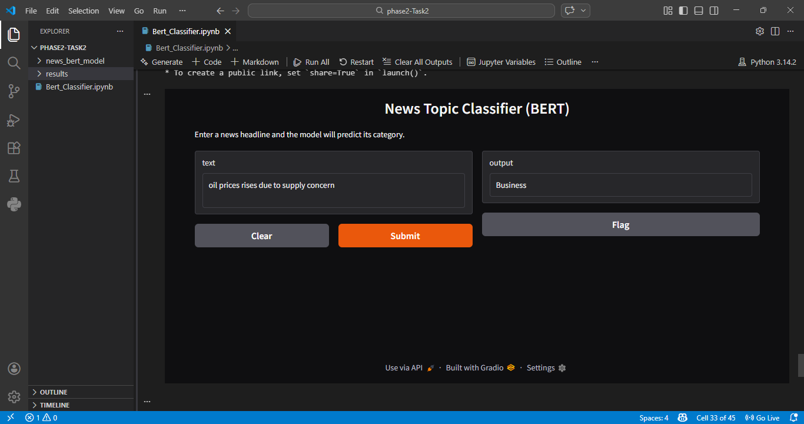

# News Topic Classifier using BERT

This project implements a news headline classification system using a pretrained BERT model.  
The model is fine-tuned on the AG News dataset to classify news headlines into four categories.

## Categories
- World
- Sports
- Business
- Sci/Tech

## Project Pipeline

Dataset → Tokenization → BERT Fine-Tuning → Evaluation → Gradio Demo

## Technologies Used

- Python
- PyTorch
- Hugging Face Transformers
- Hugging Face Datasets
- Scikit-learn
- Gradio

## Dataset

The project uses the AG News dataset which contains news headlines labeled into four categories.

## Model

A pretrained BERT model (`bert-base-uncased`) was fine-tuned for sequence classification with four output labels.

## Evaluation Metrics

The model performance was evaluated using:

- Accuracy
- F1 Score

These metrics measure how well the model classifies news headlines into the correct categories.

## Demo Interface

A Gradio interface was implemented to allow users to enter a news headline and receive the predicted category from the trained model.

## Example Prediction

Input:
NASA launches new satellite into orbit

Output:
Sci/Tech

## How to Run the Project

1. Install required libraries
pip install transformers datasets torch scikit-learn gradio

2. Run the Jupyter notebook
Bert_Classifier.ipynb

3. Launch the Gradio interface to test predictions.

## Future Improvements

- Train on the full dataset for better accuracy
- Add confusion matrix visualization
- Deploy the model as a web application

  ## Demo

The model can classify news headlines into World, Sports, Business, and Sci/Tech categories using a simple interface.

  ---

## Author

**Ume Habiba**  
BS Information Technology Student  

This project was developed as part of an NLP learning project using BERT for news topic classification.

---

## License

This project is for educational and research purposes.
